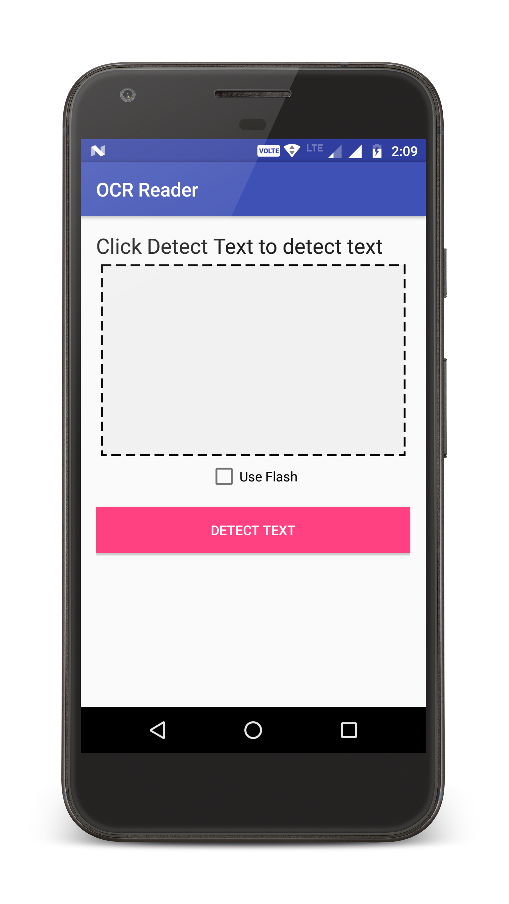
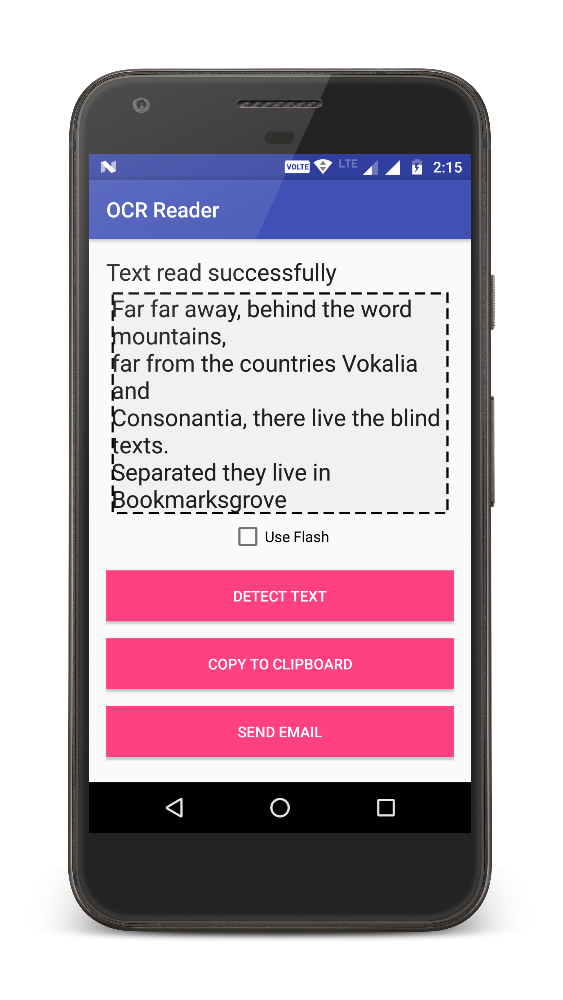

# OCR-Reader
An Android app to extract text from camera preview directly.

## Download
Download app from [here](https://github.com/DevipriyaSarkar/OCR-Reader/releases).

## Screenshots

## License
The content of this repository is licensed under [MIT LICENSE](LICENSE).
